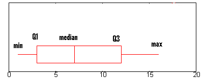

```{r setup, include=FALSE}
knitr::opts_chunk$set(message=FALSE,warning=FALSE, cache=TRUE, echo=FALSE)
```

```{css, echo=FALSE}

h1 {
  font-weight: bold;
  font-size: 28px;
  text-align: center;
}

h2 {
  font-weight: bold;
  font-size: 22px;
    text-align: center;
}

h3 {
  font-weight: bold;
  font-size: 24px;
}

h4 {
  font-weight: bold;
  font-size: 20px;
}

h5 {
  font-weight: bold;
  font-size: 16px;
}

```


```{r}
# File Setup ----
library(tidyverse)
library(ggthemes)
library(ggrepel)
library(extrafont)
library(readxl)
library(DT)
library(gt)
library(DataExplorer)
library(tidyquant)
library(markdown)
library(writexl)


cat_codes <- read_xlsx("/Users/barnesj/OneDrive - USMC-MCCS.ORG/Utilization/iNFADS/Data/MCCS_Facility_ Inventory_Report.XLSX",
  sheet = "Cat_code",
  col_types = c("numeric", "text", "text", "text")
)

fac <- read_xlsx("/Users/barnesj/OneDrive - USMC-MCCS.ORG/Utilization/iNFADS/Data/MCCS_Facility_ Inventory_Report.XLSX",
  sheet = "Facility",
  skip = 1,
  col_types = c(
    "text", "text", "text", "text", "text",
    "numeric", "numeric", "date", "text", "date",
    "date"
  )
)

# infads <- read_rds("/Users/barnesj/OneDrive - USMC-MCCS.ORG/Utilization/iNFADS/Data/infads_clean") # read in the cleaned data

utl <- read_xlsx("/Users/barnesj/OneDrive - USMC-MCCS.ORG/Utilization/iNFADS/Data/MCCS_Facility_ Inventory_Report.XLSX",
  sheet = "Sheet1",
  skip = 1
)

fac <- fac %>%
  janitor::clean_names() %>%
  separate(mccs_installation_name, c("num", "installation"), sep = 7) %>%
  separate(i_nfads_predominant_current_use_category_code, c("usecode", "fac_usedesc"), sep = 6) %>%
  select(
    RPUID = i_nfads_real_property_unique_id,
    usecode,
    fac_usedesc,
    installation,
    prv = i_nfads_current_prv,
    fci = i_nfads_facility_condition_index,
    fci_dt = i_nfads_fci_date,
    build_dt = i_nfads_facility_built_date
  ) %>%
  # coverting dates to ymd format
  mutate(
    usecode = usecode %>% as.numeric(),
    fci_dt = ymd(fci_dt) %>% replace_na(ymd(0000 / 00 / 00)),
    build_dt = ymd(build_dt) %>% replace_na(ymd(0000 / 00 / 00))
  ) %>%
  # adding new column called Q-Rating based on the FCI
  mutate(q_rating = case_when(
    fci <= 59 ~ "Q4",
    fci <= 79 ~ "Q3",
    fci <= 89 ~ "Q2",
    TRUE ~ "Q1"
  )) %>%
  # mutate(Category = Category %>% replace_na("Z")) %>%
  mutate(installation = case_when(
    installation %>% str_to_lower() %>% str_detect("butler") ~ "MCB Butler",
    installation %>% str_to_lower() %>% str_detect("mcb camp pendleton") ~ "MCB Pendleton",
    installation %>% str_to_lower() %>% str_detect("mcb camp lejeune") ~ "MCB Lejeune",
    installation %>% str_to_lower() %>% str_detect("mcb hawaii") ~ "MCB Hawaii",
    installation %>% str_to_lower() %>% str_detect("mcas iwakuni") ~ "MCAS Iwakuni",
    installation %>% str_to_lower() %>% str_detect("mcas cherry") ~ "MCAS Cherry Point",
    installation %>% str_to_lower() %>% str_detect("marine corps base quantico") ~ "MCB Quantico",
    installation %>% str_to_lower() %>% str_detect("mcagcc") ~ "MCAGCC 29 Palms",
    installation %>% str_to_lower() %>% str_detect("miramar") ~ "MCAS Miramar",
    installation %>% str_to_lower() %>% str_detect("yuma") ~ "MCAS Yuma",
    installation %>% str_to_lower() %>% str_detect("san diego") ~ "MCRD San Diego",
    installation %>% str_to_lower() %>% str_detect("mcrd beaufort") ~ "MCRD PI",
    installation %>% str_to_lower() %>% str_detect("new river") ~ "MCAS New River",
    installation %>% str_to_lower() %>% str_detect("futenma") ~ "MCAS Futenma",
    installation %>% str_to_lower() %>% str_detect("mcas beaufort") ~ "MCAS Beaufort",
    installation %>% str_to_lower() %>% str_detect("barstow") ~ "MCLB Barstow",
    installation %>% str_to_lower() %>% str_detect("albany") ~ "MCLB Albany",
    installation %>% str_to_lower() %>% str_detect("orleans") ~ "MARFORRES",
    installation %>% str_to_lower() %>% str_detect("washington") ~ "MBW (8th & I)",
    installation %>% str_to_lower() %>% str_detect("garden") ~ "Garden City",
    installation %>% str_to_lower() %>% str_detect("bridgeport") ~ "MWTC Bridgeport",
    installation %>% str_to_lower() %>% str_detect("mujuk") ~ "Camp Mujuk",
    installation %>% str_to_lower() %>% str_detect("mcas camp pendleton") ~ "MCAS Pendleton",
    installation %>% str_to_lower() %>% str_detect("allen") ~ "Camp Elmore",
    installation %>% str_to_lower() %>% str_detect("mcsf") ~ "MCSF Blount Island",
    installation %>% str_to_lower() %>% str_detect("4th mardiv") ~ "HQ 4th MARDIV",
    installation %>% str_to_lower() %>% str_detect("mcsptact") ~ "Kansas City"
  )) %>%
  mutate(RPUID = RPUID %>% as.character()) %>%
  mutate(RM = prv * 0.025)


`%notin%` <- Negate(`%in%`)

utl <- utl %>%
  janitor::clean_names() %>%
  janitor::remove_empty(c("rows"), quiet = TRUE) %>%
  select(
    RPUID = i_nfads_real_property_unique_id,
    use = i_nfads_use_category_code,
    fac_num = i_nfads_facility_number,
    installation = mccs_installation_name,
    program = mccs_business_program,
    asset_name = i_nfads_real_property_asset_name,
    fac_use = i_nfads_facility_use,
    FY2022 = fsm_fy22_sustainment_cost,
    Cat = i_nfads_naf_category,
    adq = i_nfads_adq_area_measure,
    sub = i_nfads_sub_area_measure,
    iadq = i_nfads_iadq_area_measure,
    adq_alt = i_nfads_adq_alternate_measure,
    sub_alt = i_nfads_sub_alternate_measure,
    iadq_alt = i_nfads_iadq_alternate_measure,
    adq_other = i_nfads_adq_other_measure,
    sub_other = i_nfads_sub_other_measure,
    iadq_other = i_nfads_iadq_other_measure,
    other_unit_measure = i_nfads_other_unit_meas
  ) %>%
  separate(use, into = c("use_code", "use_desc"), sep = 6) %>%
  mutate(use_code = use_code %>% as.numeric()) %>%
  # Remove divestments
  filter(RPUID %notin% c(
    21104, 54390, 25139, 24922, 18187, 21378, 21379, 43713, 43714, 35068, 35073, 35080,
    33751, 38891, 38889, 38895, 47139, 40535, 43543, 43544, 43744, 40524, 40529,
    40532, 40526, 40534, 47876, 46374, 39594, 54613
  )) %>%
  mutate(
    adq = adq %>% replace_na(0),
    sub = sub %>% replace_na(0),
    iadq = iadq %>% replace_na(0),
    adq_other = adq_other %>% replace_na(0),
    sub_other = sub_other %>% replace_na(0),
    iadq_other = iadq_other %>% replace_na(0),
    adq_alt = adq_alt %>% replace_na(0),
    sub_alt = sub_alt %>% replace_na(0),
    iadq_alt = iadq_alt %>% replace_na(0),
    FY2022 = FY2022 %>% replace_na(0)
  ) %>%
  mutate(total_measure = adq + sub + iadq,
         alt_total_measure = adq_alt + sub_alt + iadq_alt,
         other_total_measure = adq_other + sub_other + iadq_other) %>%
  group_by(RPUID) %>%

  mutate(use_pct_area = total_measure / sum(total_measure),
         use_pct_other = other_total_measure / sum(other_total_measure),
         use_pct_alt = alt_total_measure / sum(alt_total_measure),
         use_pct_area = use_pct_area %>% replace_na(0),
         use_pct_alt = use_pct_alt %>% replace_na(0),
         use_pct_other = use_pct_other %>% replace_na(0)) %>%
  
  mutate(fac_use_pct = if_else(use_pct_area > 0, use_pct_area, 
                               if_else(use_pct_alt > 0, use_pct_alt, use_pct_other))) %>% 
  ungroup() %>%
  mutate(region = case_when(
    installation %in% c(
      "M00146 MCAS CHERRY POINT NC",
      "M00263 MCRD BEAUFORT PI SC",
      "M60169 MCAS BEAUFORT SC",
      "M62573 MCAS NEW RIVER JAX NC",
      "M67001 MCB CAMP LEJEUNE NC",
      "M67004 MCLB ALBANY GA",
      "M67695 MCSF BLOUNT ISLAND"
    ) ~ "MCIEAST",
    installation %in% c(
      "M00264 MARINE CORPS BASE QUANTICO VA",
      "M67029 MARBKS WASHINGTON DC"
    ) ~ "MCINCR",
    installation %in% c(
      "M00318 MCB HAWAII KANEOHE",
      "M20810 CAMP MUJUK REPUBLIC OF KOREA",
      "M63026 MCAS FUTENMA JA",
      "M67400 MCB CAMP S D BUTLER OKINAWA JA",
      "M62613 MCAS IWAKUNI JA"
    ) ~ "MCIPAC",
    installation %in% c(
      "M00681 MCB CAMP PENDLETON CA",
      "M62204 MCLB BARSTOW CA",
      "M62974 MCAS YUMA AZ",
      "M67604 MCAS CAMP PENDLETON CA",
      "M67865 MCAS MIRAMAR"
    ) ~ "MCIWEST",
    installation %in% c(
      "M00243 MARCORPRCUITDEP SAN DIEGO CA",
      "M64495 MARCORPSMWTC BRIDGEPORT CA",
      "M67399 MCAGCC TWENTYNINE PALMS CA"
    ) ~ "SLTI",
    installation %in% c(
      "M09036 CAMP ALLEN",
      "M67011 MARCORPS DIST 1 GARDEN CITY NY",
      "M67386 MCSPTACT KANSAS CITY MO",
      "M67861 MARCORRESFOR NEW ORLEANS LA",
      "M68479 HDQTRS 4TH MARDIV NEW ORLEANS"
    ) ~ "NONE"
  )) %>%
  mutate(RPUID = RPUID %>% as.character())

fac_mapped <- utl %>%
  inner_join(cat_codes, by = c("use_code" = "use_code")) 
 

fac_mapped <- fac_mapped %>%
  left_join(fac, by = "RPUID") %>% 
  filter(naf_cat %in% c("A", "B", "C", "L"))

# RPUID_count <- fac_mapped %>%
#   group_by(RPUID) %>%
#   count(RPUID)
# 
# fac_mapped <- fac_mapped %>%
#   inner_join((RPUID_count))


df_clean <- fac_mapped %>%
  mutate(
    sus = if_else(naf_cat == "C", FY2022 * 2, FY2022),
    sus = sus %>% replace_na(0)
  ) %>%
  mutate(
    RM_corrected = RM * fac_use_pct) 


df_final <- df_clean %>%
  select(region, installation = installation.y, RPUID, use_code, use_desc, fac_use, naf_cat, op_activity, fac_num, facility_desc, fac_usedesc, asset_name, fci, fci_dt, q_rating, build_dt, adq, sub, iadq, total_measure, adq_alt, sub_alt, sub_other, alt_total_measure, adq_other, sub_other, iadq_other, other_total_measure, other_unit_measure, use_pct_area, use_pct_alt, use_pct_other, fac_use_pct, prv, RM, RM_corrected, sus)

write_xlsx(df_final, path = "/Users/barnesj/OneDrive - USMC-MCCS.ORG/Utilization/iNFADS/Data/df_finalv3.xlsx")


```

<br>

Note: The current report is based on utilization information unless otherwise noted. 

Data dictionary and assumptions are at the end of this report. 

<br>

# Exploring Costs 

---

## Costs by Category

<center>
Facility Sustainment, Restoration and Modernization (FSRM)
</center>

<br>

```{r}

# Category FSRM ----
category <- df_final %>%
  group_by(naf_cat) %>%
  summarise(
    total_sus = sum(sus),
    total_rm = sum(RM_corrected),
    total = sum(sus) + sum(RM_corrected)
  ) %>%
  arrange(naf_cat) %>%
  gt() %>% 
   tab_header(
  title = md("*Annual* MCCS FSRM Costs by Category"),
  subtitle = md("*iNFADS* data retrieved **Jun 17, 2021**")
) %>% 
  fmt_currency(
    columns = c(total_sus, total_rm, total),
    currency = "USD", 
    decimals = 0
) %>% 
  cols_align(
  align = c("left"),
  columns = everything()
) %>% 
  tab_footnote(
    footnote = "Funding agnostic", 
    locations = cells_title(groups = "title")
) %>% 
  tab_footnote(
    footnote = "2.5% of PRV (MCICOM Metric)", 
    locations = cells_column_labels(
      columns = total_rm
    )
) %>% 
  tab_footnote(
    footnote = "Cat c - 2x iNFADS FYDP average annual sustainment costs", 
    locations = cells_column_labels(
      columns = total_sus)
) %>% 
    tab_footnote(
    footnote = "Nominal dollars", 
    locations = cells_title(groups = "title")
)  %>% 
  tab_footnote(
    footnote = "Category L= Lodging", 
    locations = cells_body(
      columns = naf_cat,
      rows = 4)
) %>%
  grand_summary_rows(
  columns = c(total_sus, total_rm, total),
  fns =  list(
      Total = ~sum(.)),
  missing_text = "FSRM",
  formatter = fmt_currency,
  decimals = 0
  ) %>% 
  cols_label(
    naf_cat = "Categroy",
    total_sus = "Sustainment",
    total_rm = "R & M",
    total = "Total"
  )
  
  

category


```
<br>

---

## Costs by Region

<br>


```{r}
# Region FSRM ----

region <- df_final %>%
  group_by(region) %>%
  summarise(
    total_sus = sum(sus),
    total_rm = sum(RM_corrected),
    total = sum(sus) + sum(RM_corrected)
  ) %>%
  arrange(desc(total)) %>%
  gt() %>% 
   tab_header(
  title = md("*Annual* MCCS FSRM Costs by Region"),
  subtitle = md("*iNFADS* data retrieved **Jun 17, 2021**")
) %>% 
  fmt_currency(
    columns = c(total_sus, total_rm, total),
    currency = "USD", 
    decimals = 0
) %>% 
  cols_align(
  align = c("left"),
  columns = everything()
) %>% 
  tab_footnote(
    footnote = "Funding agnostic", 
    locations = cells_title(groups = "title")
) %>% 
  tab_footnote(
    footnote = "2.5% of PRV (MCICOM Metric)", 
    locations = cells_column_labels(
      columns = total_rm
    )
) %>% 
  tab_footnote(
    footnote = "2x iNFADS FYDP average annual sustainment costs", 
    locations = cells_column_labels(
      columns = total_sus)
) %>% 
    tab_footnote(
    footnote = "Nominal dollars", 
    locations = cells_title(groups = "title")
) %>% 
  tab_footnote(
    footnote = "Garden City, Camp Elmore, Kansas City, MARFORRES, 4th MARDIV",
    cells_body(columns = region, rows = 6)
) %>%
  grand_summary_rows(
  columns = c(total_sus, total_rm, total),
  fns =  list(
      Total = ~sum(.)),
  missing_text = "FSRM",
  formatter = fmt_currency,
  decimals = 0
  ) %>% 
  cols_label(
    region = "Region",
    total_sus = "Sustainment",
    total_rm = "R & M",
    total = "Total"
  )

region
```
<br>

---

## Costs by Program

<br>

```{r}

# Program FSRM ----

program <- df_final %>%
  group_by(op_activity) %>%
  summarise(
    total_sus = sum(sus),
    total_rm = sum(RM_corrected),
    total = sum(sus) + sum(RM_corrected)
  ) %>%
  arrange(desc(total)) %>%
 gt() %>% 
   tab_header(
  title = md("*Annual* MCCS FSRM Costs by Program"),
  subtitle = md("*iNFADS* data retrieved **Jun 17, 2021**")
) %>% 
  fmt_currency(
    columns = c(total_sus, total_rm, total),
    currency = "USD", 
    decimals = 0
) %>% 
  cols_align(
  align = c("left"),
  columns = everything()
) %>% 
  tab_footnote(
    footnote = "Funding agnostic", 
    locations = cells_title(groups = "title")
) %>% 
  tab_footnote(
    footnote = "2.5% of PRV (MCICOM Metric)", 
    locations = cells_column_labels(
      columns = total_rm
    )
) %>% 
  tab_footnote(
    footnote = "2x iNFADS FYDP average annual sustainment costs", 
    locations = cells_column_labels(
      columns = total_sus)
) %>% 
    tab_footnote(
    footnote = "Nominal dollars", 
    locations = cells_title(groups = "title")
) %>%
  grand_summary_rows(
  columns = c(total_sus, total_rm, total),
  fns =  list(
      Total = ~sum(.)),
  missing_text = "FSRM",
  formatter = fmt_currency,
  decimals = 0
  ) %>% 
  cols_label(
    op_activity = "Program",
    total_sus = "Sustainment",
    total_rm = "R & M",
    total = "Total"
  )

program

sqft_total <- df_final %>%
  summarise(total = (sum(total_measure))) %>% 
  mutate(total = total %>% scales::number(big.mark = ","))

```
<br>

---

## Use Category Top 10


*Facility Type Code* — The Facility Type Code determines the category code of the facility. The code ranges from category I to category IV and is tied to the DoD FAC Code. Each Category Code has an accompanying category use description. 


<br>

```{r}
# Use Category Helper ----

num_use_desc <-  df_final %>% 
  distinct(use_desc) %>% 
  count()

use_desc_total <- df_final %>% 
  group_by(use_desc) %>% 
  summarise(total_sus = sum(sus),
            total_rm = sum(RM_corrected),
            total = total_sus + total_rm) %>% 
  arrange(desc(total)) %>% 
  ungroup() %>% 
  mutate(pct = total / sum(total)) %>% 
  mutate(use_desc = use_desc %>% fct_reorder(pct)) %>% 
  head(10) %>% 
  summarise(total = sum(pct)) %>% 
  mutate(total = total %>% scales::percent())

```


There are a total of **`r num_use_desc`** distinct use categories within data set. The top 10 use category descriptions account for over **`r use_desc_total`** of the total costs in the MCCS portfolio. 


```{r}
# Use Category ----

top_10_use_categroy <- df_final %>% 
  group_by(use_desc) %>% 
  summarise(total_sus = sum(sus),
            total_rm = sum(RM_corrected),
            total = total_sus + total_rm) %>% 
  mutate(use_desc = use_desc %>% fct_reorder(total)) %>% 
  arrange(desc(total)) %>% 
  head(10) %>% 
  gt() %>% 
   tab_header(
  title = md("Top 10 most expensive iNFADS Use Category"),
  subtitle = md("*iNFADS* data retrieved **Jun 17, 2021**")
) %>% 
  fmt_currency(
    columns = c(total_sus, total_rm, total),
    currency = "USD", 
    decimals = 0
) %>% 
  cols_align(
  align = c("left"),
  columns = everything()
) %>% 
  tab_footnote(
    footnote = "Based on total FSRM costs", 
    locations = cells_title(groups = "title")
) %>% 
  tab_footnote(
    footnote = "2.5% of PRV (MCICOM Metric)", 
    locations = cells_column_labels(
      columns = total_rm
    )
) %>% 
  tab_footnote(
    footnote = "2x iNFADS FYDP average annual sustainment costs", 
    locations = cells_column_labels(
      columns = total_sus)
) %>% 
    tab_footnote(
    footnote = "Nominal dollars", 
    locations = cells_title(groups = "title")
) %>% 
    tab_footnote(
    footnote = str_glue("There are {num_use_desc} use categories in dataset"), 
    locations = cells_title(groups = "title")
) %>%
  grand_summary_rows(
  columns = c(total_sus, total_rm, total),
  fns =  list(
      Total = ~sum(.)),
  missing_text = "FSRM",
  formatter = fmt_currency,
  decimals = 0
  ) %>% 
  cols_label(
    use_desc = "Use Category",
    total_sus = "Sustainment",
    total_rm = "R & M",
    total = "Total"
  )

top_10_use_categroy


# df_final %>% 
#   select(use_desc, naf_cat) %>% 
#   group_by(use_desc, naf_cat) %>% 
#   count() %>% 
#   ungroup() %>% 
#   mutate(pct = n / sum(n)) %>% 
#   arrange(desc(pct)) %>% 
#   head(10) %>% 
#   janitor::adorn_totals()
  

```

---

<br>

## Program Costs Data Table

```{r}

cost_by_Program_DT <- df_final %>%
  mutate(count = 1) %>% 
  #mutate(decade = floor_date(build_dt, years(10)) %>% year()) %>%
  group_by(installation, naf_cat, op_activity, use_desc, facility_desc,asset_name) %>%
  summarise(Sustainment = sum(sus),
            R_M = sum(RM_corrected),
            Total = sum(RM_corrected, sus),
            count = sum(count)) %>% 
  arrange(installation) %>% 
  datatable(colnames = c("Installation", "Categroy", "Program", "Use Description", "Asset Name", "Sustainment", "R_M", "Total", "Count"),
            options = list(columnDefs = list(list(className = 'dt-center', targets = "_all")),
  initComplete = JS(
    "function(settings, json) {",
    "$(this.api().table().header()).css({'background-color': '#2c3e50', 'color': '#fff'});",
    "}")
)) %>% 
  formatCurrency(c('Sustainment','R_M','Total'), digits = 0)

cost_by_Program_DT

```

<br>

---

# Exploring SqFt Utilization


Total utilization of MCCS according to iNFADS is **`r sqft_total`** square feet (Total Measure = adq + iadq + sub).

<br>
Note: Utilization such as athletic fields, outdoor playing courts(basketball, volleyball, etc), playgrounds and Marina/Boat Ramp's are typically not included in total measure of square foot utilization)

Note: The trends are based on MCCS existing utilization by build date. 

<br>

## Trends

<br>

##### What is the trend of sqaure foot utilization by decade and Program?


Exchange Operations, Children and Youth and Semper Fit programs have been adding additional square footage utilization throughout the 2000 and 2010 decades (2000 - 2019). Additionally, Clubs, Commercial Recreation and less so in Lodging from the 2000 to the 2010 have slowed adding additional square footage within their programs. While Food and Beverage (Direct) and Other Business Operations have remained relatively flat. 


<br>
```{r, fig.width = 10, fig.height=5}

# Program Decade Sqft ----
program_decade_sqft <- df_final %>%
  mutate(decade = floor_date(build_dt, years(10)) %>% year()) %>%
  group_by(decade, op_activity) %>%
  summarise(total = sum(total_measure)) %>%
  ungroup() %>% 
  filter(!is.na(decade)) %>% 
  ggplot(aes(decade, total)) +
  geom_line() +
  # geom_abline() +
  geom_smooth(method = "lm", se = FALSE) +
  facet_wrap(~op_activity, scales = "free_x") +
  theme_tq() +
  theme(
    panel.grid.major = element_blank(),
    panel.grid.minor = element_blank(),
    panel.background = element_blank()
  ) +
  scale_y_continuous(labels = scales::number) +
  scale_x_continuous(breaks = c(1910,1930,1950,1970,1990,2010)) +
  labs(
    y = "Total Measure (SqFt)",
    x = "Decade",
    caption = "*Build dates are grouped by decade (ex. 2010-2019) represents decade 2010.
                Decade is based on iNFADS facility build date"
  )

program_decade_sqft


```
<br>

##### Square Footage by Decade based on Facility Build Date


```{r, fig.width = 10, fig.height=5}
# Sq by Decade----

scale <- seq(1900, 2020, by = 10)

 Sqft_by_decade <- df_final %>%
  mutate(decade = floor_date(build_dt, years(10)) %>% year()) %>%
  group_by(decade) %>%
  summarise(sqft = sum(total_measure)) %>%
  mutate(decade = decade %>% as.double(),
         decade = if_else(is.na(decade), 2020, decade)) %>% 
  ungroup() %>% 
  ggplot(aes(decade, sqft)) +
  geom_col(fill = "#2c3e50") +
  scale_x_continuous(breaks = scale) +
  theme_tq() +
    theme(
    #panel.grid.major = element_blank(),
    panel.grid.major.x = element_blank(),
    panel.grid.minor = element_blank(),
    panel.background = element_blank(),
    panel.border = element_blank()
  ) +
  labs(y = "SQFT",
    x = "Decade",
    caption = "Note: Decade 2020 only includes data from Jan 2020 to Jun 2021"
  )
 
Sqft_by_decade

```

<br>

##### Cumulative Sqare Footage by Decade base on Facility Build Date

```{r, fig.width = 10, fig.height=5}
# Sqft Cumulative ----
sq_cumulative <- df_final %>%
  mutate(decade = floor_date(build_dt, years(10)) %>% year()) %>%
  group_by(decade) %>%
  summarise(sqft = sum(total_measure)) %>%
  ungroup() %>%
  mutate(decade = decade %>% as.double(),
         decade = if_else(is.na(decade), 2020, decade), 
    cumulative = cumsum(sqft)
  ) %>%
  ggplot(aes(decade, cumulative)) +
  geom_area(fill = "#2c3e50") +
  scale_x_continuous(breaks = scale) +
  scale_y_continuous(labels = scales::number_format()) +
    theme_tq() +
    theme(
    #panel.grid.major = element_blank(),
    panel.grid.major.x = element_blank(),
    panel.grid.minor = element_blank(),
    panel.background = element_blank(),
    panel.border = element_blank()
  ) +
  labs(y = "SQFT",
    x = "Decade"
  )

sq_cumulative

```

<br>

---

## Percent of Total

<br>

##### What is the percent of total square foot utilization by Category?

```{r}
pct_c_sqft <- df_final %>%
  group_by(naf_cat) %>%
  summarise(total = sum(total_measure)) %>%
  mutate(pct = total / sum(total),
         pct = pct %>% replace_na(0),
         naf_cat = naf_cat %>% fct_reorder(pct)) %>% 
  arrange(naf_cat) %>% 
  ungroup() %>% 
  filter(naf_cat == "C") %>% 
  summarise(pct = sum(pct)) %>% 
  mutate(pct = pct %>% scales::percent())
```

Category C accounts for **`r pct_c_sqft`** of MCCS total utilization. 

<br>
```{r, fig.width = 10, fig.height=3}

naf_cat_sqft_pct_total <- df_final %>%
  group_by(naf_cat) %>%
  summarise(total = sum(total_measure)) %>%
  mutate(pct = total / sum(total),
         pct = pct %>% replace_na(0),
         naf_cat = naf_cat %>% fct_reorder(pct)) %>% 
  arrange(naf_cat) %>% 
  ungroup() %>% 
  # mutate(decade = if_else(is.na(year), 2020, decade)) %>%
  ggplot(aes(pct, naf_cat)) +
  geom_col(fill = "#2c3e50") +
  # geom_smooth(method = "lm", se = FALSE) +
    theme_tq() +
    theme(
    #panel.grid.major = element_blank(),
    panel.grid.major.y = element_blank(),
    panel.grid.minor = element_blank(),
    panel.background = element_blank(),
    panel.border = element_blank()
  ) +
  scale_x_continuous(labels = scales::percent) +
  labs(
    y = "",
    x = "Precent of Total (SqFt)"
  )

naf_cat_sqft_pct_total

```
<br>
<br>

##### What is the FSRM cost per square foot utilization by Category?

<br>
```{r}
avg_sqft_cat <- df_final %>% 
  mutate(total = RM_corrected + sus) %>% 
  group_by(naf_cat) %>% 
  summarise(total = sum(total),
            total_sqft = sum(total_measure)) %>% 
  mutate(avg_fsrm_cost = total / total_sqft,
         avg_cost_text = avg_fsrm_cost %>% scales::dollar()) %>% 
  arrange(naf_cat) %>% 
  mutate(naf_cat = naf_cat %>% fct_reorder(avg_fsrm_cost)) %>% 
  select(naf_cat, total, total_sqft, avg_fsrm_cost) %>% 
  gt() %>% 
   tab_header(
  title = md("FSRM SqFt Utilization Costs by Category"),
  subtitle = md("*iNFADS* data retrieved **Jun 17, 2021**")
) %>% 
  fmt_currency(
    columns = c(avg_fsrm_cost),
    currency = "USD", 
    decimals = 2
) %>% 
  fmt_number(
    columns = c(total, total_sqft),
    decimals = 0
) %>% 
  cols_align(
  align = c("left"),
  columns = everything()
) %>% 
  tab_footnote(
    footnote = "Funding agnostic", 
    locations = cells_column_labels(columns = total)
) %>% 
  grand_summary_rows(
  columns = c(total),
  fns =  list(
      Total = ~sum(.)),
  missing_text = "",
  formatter = fmt_currency,
  decimals = 0
  ) %>% 
   grand_summary_rows(
  columns = c(total_sqft),
  fns =  list(
      Total = ~sum(.)),
  missing_text = "",
  formatter = fmt_number,
  decimals = 0
  ) %>% 
  cols_label(
    naf_cat = "Category",
    total = "Total FSRM",
    total_sqft = "Total SqFt",
    avg_fsrm_cost = "Cost Per SqFT"
  )

avg_sqft_cat
```


<br>

##### What is percent of total square foot utilization by Program?

```{r}
# Program Helper SqFt ----
top_3_program_names <- df_final %>%
  group_by(op_activity) %>%
  summarise(total = sum(total_measure)) %>%
  mutate(pct = total / sum(total),
         pct = pct %>% replace_na(0),
         op_activity = op_activity %>% fct_reorder(pct)) %>% 
  arrange(desc(pct)) %>% 
  head(3) %>% 
  pull(op_activity)


top_3_programs_pct <- df_final %>%
  group_by(op_activity) %>%
  summarise(total = sum(total_measure)) %>%
  mutate(pct = total / sum(total),
         pct = pct %>% replace_na(0),
         op_activity = op_activity %>% fct_reorder(pct)) %>% 
  arrange(desc(pct)) %>% 
  head(3) %>% 
  summarise(total = sum(pct)) %>% 
  mutate(total = total %>% scales::percent(accuracy = 2))
  


```

```{r}
# fb_direct sqft helper ----
fb_direct_pct <- df_final %>%
  group_by(op_activity) %>%
  summarise(total = sum(total_measure)) %>%
  mutate(pct = total / sum(total),
         pct = pct %>% replace_na(0),
         op_activity = op_activity %>% fct_reorder(pct)) %>% 
  arrange(desc(pct)) %>% 
  filter(op_activity == "Food & Beverage (Direct)") %>% 
  summarise(pct = sum(pct)) %>% 
  mutate(pct = pct %>% scales::percent())

fb_direct_fsrm <-  df_final %>%
  group_by(op_activity) %>%
  summarise(
    total_sus = sum(sus),
    total_rm = sum(RM_corrected),
    total = sum(sus) + sum(RM_corrected)
  ) %>%
  arrange(desc(total)) %>% 
  filter(op_activity == "Food & Beverage (Direct)") %>% 
   summarise(total = sum(total)) %>% 
   mutate(total = total %>% scales::dollar(big.mark = ","))

fb_direct_rank <- df_final %>%
  group_by(op_activity) %>%
  summarise(
    total_sus = sum(sus),
    total_rm = sum(RM_corrected),
    total = sum(sus) + sum(RM_corrected)
  ) %>%
  arrange(desc(total)) %>% 
  mutate(rank = dense_rank(desc(total))) %>% 
    filter(op_activity == "Food & Beverage (Direct)") %>% 
   summarise(total = sum(rank))


fb_direct_pct_fsrm <-  df_final %>%
  group_by(op_activity) %>%
  summarise(
    total_sus = sum(sus),
    total_rm = sum(RM_corrected),
    total = sum(sus) + sum(RM_corrected)
  ) %>%
  arrange(desc(total)) %>% 
  ungroup() %>% 
  mutate(pct = total / sum(total)) %>% 
 filter(op_activity == "Food & Beverage (Direct)") %>% 
 summarise(pct = sum(pct)) %>% 
 mutate(pct = pct %>% scales::percent())


```
**`r top_3_program_names`** account for roughly **`r top_3_programs_pct`** of MCCS total square foot utilization.

While Food & Beverage (Direct) only accounts for just over **`r fb_direct_pct`** of the total MCCS sqft utilization it ranks number **`r fb_direct_rank`** in total FSRM costs at a total cost of **`r fb_direct_fsrm`** or **`r fb_direct_pct_fsrm`** of all FSRM costs. 

```{r, fig.width = 10, fig.height=5}
# Program SqFt Pct----


program_sqft_pct <-  df_final %>%
  group_by(op_activity) %>%
  summarise(total = sum(total_measure)) %>%
  mutate(pct = total / sum(total),
         pct = pct %>% replace_na(0),
         op_activity = op_activity %>% fct_reorder(pct)) %>% 
  arrange(desc(pct)) %>% 
  ungroup() %>% 
  # mutate(decade = if_else(is.na(year), 2020, decade)) %>%
  ggplot(aes(pct, op_activity)) +
  geom_col(fill = "#2c3e50") +
  # geom_smooth(method = "lm", se = FALSE) +
    theme_tq() +
    theme(
    #panel.grid.major = element_blank(),
    panel.grid.major.y = element_blank(),
    panel.grid.minor = element_blank(),
    panel.background = element_blank(),
    panel.border = element_blank()
  ) +
  scale_x_continuous(labels = scales::percent) +
  labs(
    y = "",
    x = "Precent of Total (SqFt)"
  )

program_sqft_pct

```
<br>
<br>

##### What is the FSRM cost per square foot utilization by Program?


```{r}

# Avg Costs per Sqft Helper ----
avg_cost_program <- df_final %>% 
  mutate(total = RM_corrected + sus) %>% 
  group_by(op_activity) %>% 
  summarise(total = sum(total),
            total_sqft = sum(total_measure)) %>% 
  mutate(avg_fsrm_cost = total / total_sqft,
         avg_cost_text = avg_fsrm_cost %>% scales::dollar()) %>% 
  arrange(desc(avg_fsrm_cost)) %>% 
  mutate(op_activity = op_activity %>% fct_reorder(avg_fsrm_cost)) %>% 
  select(op_activity, total, total_sqft, avg_fsrm_cost) %>% 
     summarise(avg = mean(avg_fsrm_cost)) %>% 
    mutate(avg = avg %>% scales::dollar())  
  
  
  
avg_cost_minus_fb <- df_final %>% 
  mutate(total = RM_corrected + sus) %>% 
  group_by(op_activity) %>% 
  summarise(total = sum(total),
            total_sqft = sum(total_measure)) %>% 
  mutate(avg_fsrm_cost = total / total_sqft,
         avg_cost_text = avg_fsrm_cost %>% scales::dollar()) %>% 
  arrange(desc(avg_fsrm_cost)) %>% 
  mutate(op_activity = op_activity %>% fct_reorder(avg_fsrm_cost)) %>% 
  select(op_activity, total, total_sqft, avg_fsrm_cost) %>% 
     filter(op_activity != "Food & Beverage (Direct)") %>% 
     summarise(avg = mean(avg_fsrm_cost)) %>% 
    mutate(avg = avg %>% scales::dollar())

  
```

The cost per sqft by program is **`r avg_cost_program`**

The cost per sqft by program, excluding Food and Beverage (Direct) is **`r avg_cost_minus_fb`**

Food and Beverage (Direct) costs 2.7x more than the next most expensive cost per square foot. 

<br>

```{r}

# Avg Cost Per SqFt by Prorgam----
avg_cost_sqft_program <- df_final %>% 
  mutate(total = RM_corrected + sus) %>% 
  group_by(op_activity) %>% 
  summarise(total = sum(total),
            total_sqft = sum(total_measure)) %>% 
  mutate(avg_fsrm_cost = total / total_sqft,
         avg_cost_text = avg_fsrm_cost %>% scales::dollar()) %>% 
  arrange(desc(avg_fsrm_cost)) %>% 
  mutate(op_activity = op_activity %>% fct_reorder(avg_fsrm_cost)) %>% 
  select(op_activity, total, total_sqft, avg_fsrm_cost) %>% 
  gt() %>% 
   tab_header(
  title = md("FSRM SqFt Utilization Costs by Program"),
  subtitle = md("*iNFADS* data retrieved **Jun 17, 2021**")
) %>% 
  fmt_currency(
    columns = c(avg_fsrm_cost),
    currency = "USD", 
    decimals = 2
) %>% 
  fmt_number(
    columns = c(total, total_sqft),
    decimals = 0
) %>% 
  cols_align(
  align = c("left"),
  columns = everything()
) %>% 
  tab_footnote(
    footnote = "Funding agnostic", 
    locations = cells_column_labels(columns = total)
) %>% 
  grand_summary_rows(
  columns = c(total),
  fns =  list(
      Total = ~sum(.)),
  missing_text = "",
  formatter = fmt_currency,
  decimals = 0
  ) %>% 
   grand_summary_rows(
  columns = c(total_sqft),
  fns =  list(
      Total = ~sum(.)),
  missing_text = "",
  formatter = fmt_number,
  decimals = 0
  ) %>% 
  cols_label(
    op_activity = "Program",
    total = "Total FSRM",
    total_sqft = "Total SqFt",
    avg_fsrm_cost = "Cost Per SqFT"
  )

  avg_cost_sqft_program 
  
  

  
```

<br>
<br>

##### What is the percent of total sqft utilization by Region?

```{r}
# Region SqFt Top 3 Helpers ----
top_3_region <- df_final %>%
  group_by(region) %>%
  summarise(total = sum(total_measure)) %>%
  mutate(pct = total / sum(total),
         pct = pct %>% replace_na(0),
         region = region %>% fct_reorder(pct)) %>% 
  arrange(desc(pct)) %>% 
  head(3) %>% 
  summarise(total = sum(pct)) %>% 
  mutate(total = total %>% scales::percent(accuracy = 2))

top_3_region_names <- df_final %>%
  group_by(region) %>%
  summarise(total = sum(total_measure)) %>%
  mutate(pct = total / sum(total),
         pct = pct %>% replace_na(0),
         region = region %>% fct_reorder(pct)) %>% 
  arrange(desc(pct)) %>% 
  head(3) %>% 
  pull(region)


```


**`r top_3_region_names`** account for over **`r top_3_region`** of the total MCCS square feet utilization. 


```{r, fig.width = 10, fig.height=5}

# region_sqft Pct ----

region_sqft_pct <-  df_final %>%
  group_by(region) %>%
  summarise(total = sum(total_measure)) %>%
  mutate(pct = total / sum(total),
         pct = pct %>% replace_na(0),
         region = region %>% fct_reorder(pct)) %>% 
  arrange(desc(pct)) %>% 
  ungroup() %>% 
  # mutate(decade = if_else(is.na(year), 2020, decade)) %>%
  ggplot(aes(pct, region)) +
  geom_col(fill = "#2c3e50") +
  # geom_smooth(method = "lm", se = FALSE) +
   theme_tq() +
    theme(
    #panel.grid.major = element_blank(),
    panel.grid.major.y = element_blank(),
    panel.grid.minor = element_blank(),
    panel.background = element_blank(),
    panel.border = element_blank()
  ) +
  scale_x_continuous(labels = scales::percent) +
  labs(
    y = "",
    x = "Precent of Total (SqFt)"
  )

region_sqft_pct


```
<br>
<br>

##### What is the FSRM costs per squre foot utilization by Region? 

Locations without a Region have substantially greater costs for FSRM per square foot utilization. 


```{r}
cost_sqft_region <- df_final %>% 
  mutate(total = RM_corrected + sus) %>% 
  group_by(region) %>% 
  summarise(total = sum(total),
            total_sqft = sum(total_measure)) %>% 
  mutate(avg_fsrm_cost = total / total_sqft,
         avg_cost_text = avg_fsrm_cost %>% scales::dollar()) %>% 
  arrange(desc(avg_fsrm_cost)) %>% 
  mutate(region = region %>% fct_reorder(avg_fsrm_cost)) %>% 
  select(region, total, total_sqft, avg_fsrm_cost) %>% 
  gt() %>% 
   tab_header(
  title = md("FSRM SqFt Utilization Costs by Region"),
  subtitle = md("*iNFADS* data retrieved **Jun 17, 2021**")
) %>% 
  fmt_currency(
    columns = c(avg_fsrm_cost),
    currency = "USD", 
    decimals = 2
) %>% 
  fmt_number(
    columns = c(total, total_sqft),
    decimals = 0
) %>% 
  cols_align(
  align = c("left"),
  columns = everything()
) %>% 
  tab_footnote(
    footnote = "Funding agnostic", 
    locations = cells_column_labels(columns = total)
) %>% 
  grand_summary_rows(
  columns = c(total),
  fns =  list(
      Total = ~sum(.)),
  missing_text = "",
  formatter = fmt_currency,
  decimals = 0
  ) %>% 
   grand_summary_rows(
  columns = c(total_sqft),
  fns =  list(
      Total = ~sum(.)),
  missing_text = "",
  formatter = fmt_number,
  decimals = 0
  ) %>% 
  cols_label(
    region = "Region",
    total = "Total FSRM",
    total_sqft = "Total SqFt",
    avg_fsrm_cost = "Cost Per SqFT"
  )


cost_sqft_region

```

<br>
<br>

##### What is the percent of total sqft utilization by Installation? 


Not surprisingly, Camp Lejuene and Camp Pendleton account for over 31% of the total square footage of MCCS, though it should be noted that MCB Butler comes in a close 3rd. The below chart highlights the top 10 installation that account for over 83% of MCCS total infrastructure. 


```{r}
# Installation Sqt Top 10 Table ----

installation_sqft_pct_table <- df_final %>%
  group_by(installation) %>%
  summarise(total = sum(total_measure)) %>%
  mutate(pct = total / sum(total),
         pct = pct %>% replace_na(0),
         installation = installation %>% fct_reorder(pct)) %>% 
  arrange(desc(pct)) %>% 
  head(10) %>% 
  gt()  %>% 
  tab_header(
  title = md("Top 10 Installations based on total sqaure feet utilization aboard the Installation"),
  subtitle = md("*iNFADS* data retrieved **Jun 17, 2021**")
) %>% 
  fmt_number(
    columns = c(total),
    decimals = 0
) %>%
  fmt_percent(
    columns = c(pct),
    decimals = 1
) %>% 
  cols_align(
  align = c("left"),
  columns = everything()
) %>% 
  grand_summary_rows(
  columns = c(total),
  fns =  list(
      Total = ~sum(.)),
  missing_text = "SqFt",
  decimals = 0
) %>% 
  grand_summary_rows(
    columns = c(pct),
    fns = list(
      Total = ~sum(.)),
    missing_text = "SqFt",
    decimals = 2,
    formatter = fmt_percent
) %>% 
  cols_label(
    installation = "Installation",
    total = "Total SqFt",
    pct = "% of Total"
  )

installation_sqft_pct_table


```

<br>


MCCS has facilities in 26 different locations. The below graph breaks down the percent of total square foot utilization by each location. 


```{r, fig.width = 10, fig.height=8}

# Installation SqFt Percent ----
installation_sqft_pct <-  df_final %>%
  group_by(installation) %>%
  summarise(total = sum(total_measure)) %>%
  mutate(pct = total / sum(total),
         pct = pct %>% replace_na(0),
         installation = installation %>% fct_reorder(pct)) %>% 
  arrange(desc(pct)) %>% 
  ungroup() %>% 
  # mutate(decade = if_else(is.na(year), 2020, decade)) %>%
  ggplot(aes(pct, installation)) +
  geom_col(fill = "#2c3e50") +
  # geom_smooth(method = "lm", se = FALSE) +
   theme_tq() +
    theme(
    #panel.grid.major = element_blank(),
    panel.grid.major.y = element_blank(),
    panel.grid.minor = element_blank(),
    panel.background = element_blank(),
    panel.border = element_blank()
  ) +
  scale_x_continuous(labels = scales::percent) +
  labs(
    y = "",
    x = "Precent of Total (SqFt)"
  )

installation_sqft_pct


```


<br>

---

# Exploring Q-Rating

Use the *Search:* box to sort or filter information in each table below. 

## Program

```{r}
utl_q1 <- q_group %>% 
  filter(q_rating == "Q1") %>% 
  count()


utl_q2 <- q_group %>% 
  filter(q_rating == "Q2") %>% 
  count()


utl_q3 <- q_group %>% 
  filter(q_rating == "Q3") %>% 
  count()


utl_q4 <- q_group %>% 
  filter(q_rating == "Q4") %>% 
  count()


```


##### Q-Rating by Program and Categroy (based on facility)


Number of **facilities** by Q-Rating

-Q1: `r utl_q1`

-Q2: `r utl_q2`

-Q3: `r utl_q3`

-Q4: `r utl_q4`


<br>

```{r}

q_group <- df_final %>% distinct(RPUID, .keep_all = TRUE)

op_activity_q <- q_group %>% 
  group_by(op_activity, naf_cat) %>% 
  count(q_rating) %>% 
  mutate(q_rating_pct = n / sum(n)) %>% 
   janitor::adorn_totals() %>% 
  datatable(colnames = c("Program", "Category", "Q-Rating", "Count", "% of Program Total"),
            options = list(columnDefs = list(list(className = 'dt-center', targets = 0:5)),
  initComplete = JS(
    "function(settings, json) {",
    "$(this.api().table().header()).css({'background-color': '#2c3e50', 'color': '#fff'});",
    "}")
)) %>% 
  formatPercentage(c('q_rating_pct'), digits = 2)

op_activity_q

```
<br>

## Category

##### Q-Rating by Category (based on utilizations)

<br>

```{r}
cat_q <- df_final %>% 
  group_by(naf_cat) %>% 
  count(q_rating) %>% 
  mutate(q_rating_pct = n / sum(n)) %>% 
  janitor::adorn_totals() %>% 
  datatable(colnames = c("Category", "Q-Rating", "Count", "% of Program Total"),
            options = list(columnDefs = list(list(className = 'dt-center', targets = 0:4)),
  initComplete = JS(
    "function(settings, json) {",
    "$(this.api().table().header()).css({'background-color': '#2c3e50', 'color': '#fff'});",
    "}")
)) %>% 
  formatPercentage(c('q_rating_pct'), digits = 2)

cat_q

```
<br>

## Region

##### Q-Rating by Region (based on facility)


<br>

```{r}
region_q <- q_group %>% 
  group_by(region) %>% 
  count(q_rating) %>% 
  mutate(q_rating_pct = n / sum(n))  %>% 
  janitor::adorn_totals() %>% 
  datatable(colnames = c("Region", "Q-Rating", "Count", "% of Program Total"),
            options = list(columnDefs = list(list(className = 'dt-center', targets = 0:4)),
  initComplete = JS(
    "function(settings, json) {",
    "$(this.api().table().header()).css({'background-color': '#2c3e50', 'color': '#fff'});",
    "}")
)) %>% 
  formatPercentage(c('q_rating_pct'), digits = 2)

# %>% 
#   gt() %>% 
#    tab_header(title = "Exploring Q-Rating by Region") %>% 
#   cols_align(align = c("center"))

region_q

```
<br>

## Installation

##### Q-Rating by Installation (based on facility)

<br>

```{r}
installation_q <- q_group %>% 
  group_by(installation) %>% 
  count(q_rating) %>% 
  mutate(q_rating_pct = n / sum(n)) %>% 
  janitor::adorn_totals() %>% 
  datatable(colnames = c("Installation", "Q-Rating", "Count", "% of Program Total"),
            options = list(columnDefs = list(list(className = 'dt-center', targets = 0:4)),
  initComplete = JS(
    "function(settings, json) {",
    "$(this.api().table().header()).css({'background-color': '#2c3e50', 'color': '#fff'});",
    "}")
)) %>% 
  formatPercentage(c('q_rating_pct'), digits = 2)
# %>% 
#   gt() %>% 
#    tab_header(title = "Exploring Q-Rating by Installation") %>% 
#   cols_align(align = c("center"))

installation_q

```
<br>

---

# Exploring the age of facilities

## Q-Rating

<br>


```{r}
age_q <- df_final %>% 
  mutate(age = today() - build_dt,
         age = round(age/365,0),
         age = age %>% as.numeric()) %>% 
  filter(!is.na(build_dt)) %>% 
  group_by(q_rating) %>% 
  summarise(avg_age = round(mean(age),0),
            median_age = round(median(age),0),
            sd_age = round(sd(age),0),
            max_age = max(age),
            min_age = min(age),
            range_age = max_age - min_age) %>% 
   datatable(colnames = c("Q-Rating", "Average Age", "Median Age", "Standard Deviation", "Max Age", "min Age", "Range"),
            options = list(columnDefs = list(list(className = 'dt-center', targets = 0:7)),
  initComplete = JS(
    "function(settings, json) {",
    "$(this.api().table().header()).css({'background-color': '#2c3e50', 'color': '#fff'});",
    "}")
))
# %>% 
#   gt() %>% 
#   tab_header(title = "Exlploring Facility Age by Q-Rating") %>% 
#   cols_align(align = c("center"))

age_q

```

<br>


How to read a boxplot:


<br>

The box and whiskers chart shows you how your data is spread out. Five pieces of information (the “five number summary“) are generally included in the chart:

-The minimum (the smallest number in the data set). The minimum is shown at the far left of the chart, at the end of the left “whisker.”

-First quartile, Q1, is the far left of the box (or the far right of the left whisker).

-The median is shown as a line in the center of the box.

-Third quartile, Q3, shown at the far right of the box (at the far left of the right whisker).

-The maximum (the largest number in the data set), shown at the far right of the box.

-Inter-quartile Range (IQR): The IQR describes the middle 50% of values when ordered from lowest to highest. To find the interquartile range (IQR), first find the median (middle value) of the lower and upper half of the data. These values are quartile 1 (Q1) and quartile 3 (Q3). The IQR is the difference between Q3 and Q1.

-If outliers are present, the whisker on the appropriate side is drawn to 1.5 * IQR rather than the data minimum or the data maximum. Small dots are drawn on the chart to indicate where suspected outliers lie. Filled circles are used for known outliers.

<br>

##### Facility age by Q-Rating (boxplot)

<br>

```{r, fig.width = 10, fig.height=5}
q_box <- q_group %>% 
  mutate(age = today() - build_dt,
         age = round(age/365,0),
         age = age %>% as.numeric()) %>% 
  filter(!is.na(build_dt)) %>% 
  mutate(q_rating = q_rating %>% fct_reorder(age)) %>% 
  ggplot(aes(age, q_rating)) + 
  geom_boxplot() +
    theme_tq() +
    theme(
    #panel.grid.major = element_blank(),
    panel.grid.major.x = element_blank(),
    panel.grid.minor = element_blank(),
    panel.background = element_blank(),
    panel.border = element_blank()
  ) +
  labs(x = "Age",
       y = "Q-Rating")

q_box
  
```


<br>

## Program

##### Facility age by Program (Table)

<br>


```{r}
program_age <- q_group %>% 
  mutate(age = today() - build_dt,
         age = round(age/365,0),
         age = age %>% as.numeric()) %>% 
  filter(!is.na(build_dt)) %>% 
  group_by(op_activity) %>% 
  summarise(avg_age = round(mean(age),0),
            median_age = round(median(age),0),
            sd_age = round(sd(age),0),
            max_age = max(age),
            min_age = min(age),
            range_age = max_age - min_age) %>% 
  datatable(colnames = c("Program", "Average Age", "Median Age", "Standard Deviation", "Max Age", "min Age", "Range"),
            options = list(columnDefs = list(list(className = 'dt-center', targets = 0:7)),
  initComplete = JS(
    "function(settings, json) {",
    "$(this.api().table().header()).css({'background-color': '#2c3e50', 'color': '#fff'});",
    "}")
))
# %>% 
#   gt() %>% 
#   tab_header(title = "Exlploring Facility Age by Program") %>% 
#   cols_align(align = c("center"))

program_age

```

<br>

##### Facility Age by Program (boxplot)

<br>


```{r, fig.width = 10, fig.height=5}

program_box <- q_group %>% 
  mutate(age = today() - build_dt,
         age = round(age/365,0),
         age = age %>% as.numeric()) %>% 
  filter(!is.na(build_dt)) %>% 
  mutate(op_activity = op_activity %>% fct_reorder(age)) %>% 
  ggplot(aes(age, op_activity)) + 
  geom_boxplot() +
  theme_tq() +
    theme(
    #panel.grid.major = element_blank(),
    panel.grid.major.x = element_blank(),
    panel.grid.minor = element_blank(),
    panel.background = element_blank(),
    panel.border = element_blank()
  ) +
  labs(x = "Age",
       y = "Program")

program_box
  
```


<br>

## Region

##### Facility Age by Region (Table)

<br>

```{r}

region_age <- q_group %>% 
  mutate(age = today() - build_dt,
         age = round(age/365,0),
         age = age %>% as.numeric()) %>% 
  filter(!is.na(build_dt)) %>% 
  group_by(region) %>% 
  summarise(avg_age = round(mean(age),0),
            median_age = round(median(age),0),
            sd_age = round(sd(age),0),
            max_age = max(age),
            min_age = min(age),
            range_age = max_age - min_age) %>%
  datatable(colnames = c("Region", "Average Age", "Median Age", "Standard Deviation", "Max Age", "min Age", "Range"),
            options = list(columnDefs = list(list(className = 'dt-center', targets = 0:7)),
  initComplete = JS(
    "function(settings, json) {",
    "$(this.api().table().header()).css({'background-color': '#2c3e50', 'color': '#fff'});",
    "}"))) 
# %>% 
#   gt() %>% 
#   tab_header(title = "Exlploring Facility Age by Region") %>% 
#   cols_align(align = c("center"))

region_age

```

<br>

##### Facility Age by Region (boxplot)

<br>

```{r, fig.width = 10, fig.height=5}
region_box <- q_group %>% 
  mutate(age = today() - build_dt,
         age = round(age/365,0),
         age = age %>% as.numeric()) %>% 
  filter(!is.na(build_dt)) %>% 
  mutate(region = region %>% fct_reorder(age)) %>% 
  ggplot(aes(age, region)) + 
  geom_boxplot() +
   theme_tq() +
    theme(
    #panel.grid.major = element_blank(),
    panel.grid.major.x = element_blank(),
    panel.grid.minor = element_blank(),
    panel.background = element_blank(),
    panel.border = element_blank()
  ) +
  labs(x = "Age",
       y = "")

region_box
  
```


<br>

## Installation

##### Facility Age by Installation (Table)

<br>

```{r}
installation_age <- q_group %>% 
  mutate(age = today() - build_dt,
         age = round(age/365,0),
         age = age %>% as.numeric()) %>% 
  filter(!is.na(build_dt)) %>% 
  group_by(installation) %>% 
  summarise(avg_age = round(mean(age),0),
            median_age = round(median(age),0),
            sd_age = round(sd(age),0),
            max_age = max(age),
            min_age = min(age),
            range_age = max_age - min_age) %>% 
  datatable(colnames = c("Installation", "Average Age", "Median Age", "Standard Deviation", "Max Age", "min Age", "Range"),
            options = list(columnDefs = list(list(className = 'dt-center', targets = 0:7)),
  initComplete = JS(
    "function(settings, json) {",
    "$(this.api().table().header()).css({'background-color': '#2c3e50', 'color': '#fff'});",
    "}")))
# %>% 
#   gt() %>% 
#   tab_header(title = "Exlploring Facility Age by Installation") %>% 
#   cols_align(align = c("center"))

installation_age

```

<br>

##### Facility Age by Installation (boxplot)

<br>

```{r, fig.width = 10, fig.height=5}
int_box <- df_final %>% 
  mutate(age = today() - build_dt,
         age = round(age/365,0),
         age = age %>% as.numeric()) %>% 
  filter(!is.na(build_dt)) %>% 
  mutate(installation = installation %>% fct_reorder(age)) %>% 
  ggplot(aes(age, installation)) + 
  geom_boxplot() +
  theme_tq() +
    theme(
    #panel.grid.major = element_blank(),
    panel.grid.major.x = element_blank(),
    panel.grid.minor = element_blank(),
    panel.background = element_blank(),
    panel.border = element_blank()
  ) +
  labs(x = "Age",
       y = "")

int_box
  
```

# Data Dictionary

__Region:__ Installations grouped within their perspective geographical region. There is a total of 5 regions (MCIWEST, MCIEAST, MCIPAC, MCINCR, SLTI)
The following locations are not associated with a region in the data set: 

1. Garden City 

2. Camp Elmore

3. Kansas City

4. MARFORRES

5. 4th MARDIV

__Installation:__ The name of the installation MCCS services are provided. Installation is derived from the MCCS Installation Name column in iNFADS. 

__RPUID:__ iNFADS Real Property Unique Identifier (Primary Key to connect facilities with utilization). 

---

[MCCS Category Codes Worksheet](https://mccsorg-my.sharepoint.com/:x:/g/personal/jason_barnes_usmc-mccs_org/EY2pByxnvI5AkBjH0x53k4EB5TkkKThKs7aqM1JOGzB_9w?e=UgoQrB)

__use_code:__ A five or six-digit code used by the Military Departments and WHS that represents a specific type of facility. Each CATCODE is mapped to a specific FAC (Facility Analysis Category), to include use of the unit of measure assigned to that FAC. 

__use_desc:__ The title of the use category associated with the Category Use Code (use_code) derived from the Appendix A - Category Codes for Navy and Marine Corps Real Property
Replacement for NAVFAC P72. [source](https://www.wbdg.org/ffc/dod/unified-facilities-criteria-ufc/ufc-2-000-05n) 


